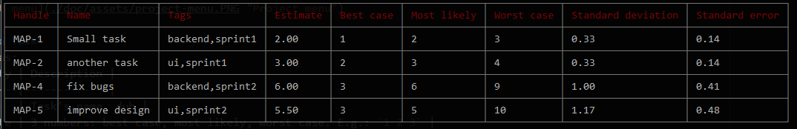

[](https://travis-ci.org/gsipos/esti-mate-cli)

[](https://coveralls.io/github/gsipos/esti-mate-cli?branch=master)


# EstiMate CLI

CLI tool for quickly drafting project estimations.
When you need to estimate a task, or a small project, then this is a tool for you.
Open a command line, start EstiMate type in your estimations, and see how much time the whole project is going to take.
After that you can export the results to a CSV file, so you can import it into a spreadsheet, and send to a project manager or sales colleague for example.

The [three-point estimation](https://en.wikipedia.org/wiki/Three-point_estimation) technique is used.
It means you have to give 3 estimations for a task instead of one.
The 3 estimate are the `best case`, `worst case`, and `most likely`.
This is more flexible, easier to express uncertainity about tasks.

## Installation
```bash
npm i esti-mate-cli -g
```

## Usage

Start with the command:
```bash
esti-mate-cli
```
or with the shorter command:
```bash
emc
```

### Creating a project
At first you will be prompted to create project by entering a few stuff:

| Property | Description |
|----------|-------------|
| Project name | A simple string to be used as a name |
| Short handle | A 2-4 character short name, like `ABC` |
| Confidence interval | more about this on [Wikipedia](https://en.wikipedia.org/wiki/Confidence_interval) |

> The project is automatically saved to a JSON file in the directory where the CLI has been started after every modification.
> You don't have to save manually.

* [Select a project](./doc/menus/choose-project-menu.md)
* [Create project](./doc/menus/create-project-menu.md)
* [Working with project](./doc/menus/project-menu.md)
  * [Add task](./doc/menus/add-task-menu.md)
  * [Show project summary](./doc/menus/show-project-summary.md)

### List task estimations



### List tags


## Project summary


> More details coming soon

## Data handling
Your data will not be sent over the network.
No analytics data is gathered currently.
EstiMate only creates a JSON file in the folder, you are running it in, to store the data You enter.
Other files(e.g.: CSV) may be created when You want to export your data in an other format.
