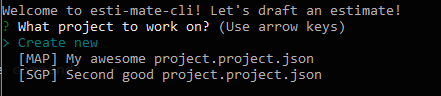
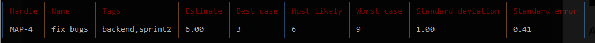
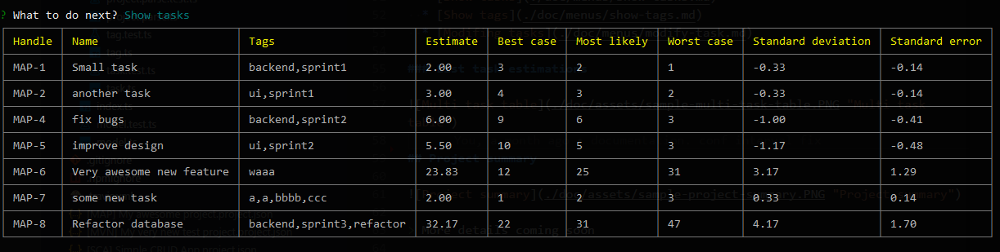

[](https://travis-ci.org/gsipos/esti-mate-cli)


# EstiMate CLI

CLI tool for quickly drafting project estimations.
The [three-point estimation](https://en.wikipedia.org/wiki/Three-point_estimation) technique is used.

## Installation
```bash
npm i esti-mate-cli -g
```

## Usage

Start with the command:
```bash
esti-mate-cli
```

### Creating a project
At first you will be prompted to create project by entering a few stuff:
| Property | Description |
|----------|-------------|
| Project name | A simple string to be used as a name |
| Short handle | A 2-4 character short name, like `ABC` |
| Confidence interval | more about this on [Wikipedia](https://en.wikipedia.org/wiki/Confidence_interval) |

The project is automatically saved to a JSON file in the directory where the CLI has been started after every modification.

### Choosing a project to work with
When the CLI is started in a directory that contains previously saved project, you can choose to load a project or create a new one.



### Working with a project
When a project is selected:


### Add a Task
A task has:
| Property | Description |
|----------|-------------|
| Name     | Task's name, duh |
| Estimate | 3 numbers: best case, most likely, worst case. E.g.: `1 2 3` |
| Tags     | Comma separated words, tasks can be grouped by tags. E.g.: `ui, sprint1, bug` |



### List task estimations



### List tags


## Project summary


> More details coming soon