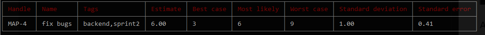

# EstiMate - Add task

Create a task with an estimate. A task consists of the following:
* name
* estimate
* tags

The `name` can be anything.

The `estimate` is 3 numbers.
Can be comma separated(`1,2,3`) or can be space separated(`1 2 3`).
Numbers can be fractions as well(`1.2 2.2 3.2`).

The `best case` value should represent the estimation where everything goes as well as it can. Roughly it has ~90% probability to take longer than this.

The `most likely` is the estimation what you expect the task to take.

The `worst case` value should represent the estimation where you expect everything to take as long as it can.
The task should have roughly 90% probability to take less time than this.

The `tag` is a comma separated string.
With tags you can categorize your tasks.
So one example could be `backend, refactor, sprint-2`.
In the project menu you can list the tags in the project with their aggregate estimations.

After successfully creating a task you'll see a small table with the info you entered, and the calculated estimate of the task.
You'll be navigated back to the [project menu](./project-menu.md).

