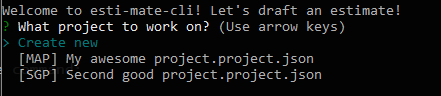

# EstiMate - Choose/Create project

This is the first menu that appears when launching EstiMate.
If you launch EstiMate in a folder that already has atleast one project JSON from before, they will appear in the list of options.
You can select to work on a project from before, or create a new project.
If there is no project from before, then this menu is skipped and EstiMate jumps immidiately to the create project menu.
On start EstiMate may give you a warning message when there is a newer version available, and you should update EstiMate.

----
#### Continue reading:
* [Create project menu](./create-project-menu.md)
* [Project menu](./project-menu.md)

