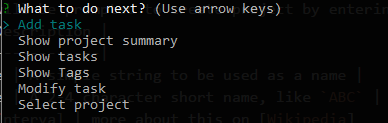

# EstiMate - Project menu

This is where you can access all the stuff you can do with a project.

| Menu   | Description |
|--------|-------------|
| [Add task](./add-task-menu.md) | create a task with an estimate |
| [Show project summary](./show-project-summary.md) | Show basic information of the project |
| [Show tasks](./show-tasks.md) | Show a table of tasks, estimations, tags |
| [Show tags](./show-tags.md) | Show a table of tags and their estimations |
| [Modify task](./modify-task.md) | Select and edit an existing task here |
| [Export tasks to CSV](./export-tasks-to-csv.md) | Export task information to a CSV file |
| [Export tags to CSV](./export-tags-to-csv.md) | Export tag information to a CSV file |
| [Select project](./choose-project-menu.md) | Go back to the project selection menu |

