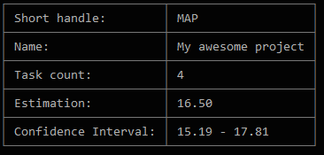

# EstiMate - Show project summary

Shows a table with some information about the project, like the project `name`, `short handle`.
It also shows the final `estimate` value, which is a sum of the tasks estimation(the weighted average of the task's estimations).
The confidence interval indicates the overall reliability of the estimations.

---
#### Continue:
* [Project menu](./project-menu.md)