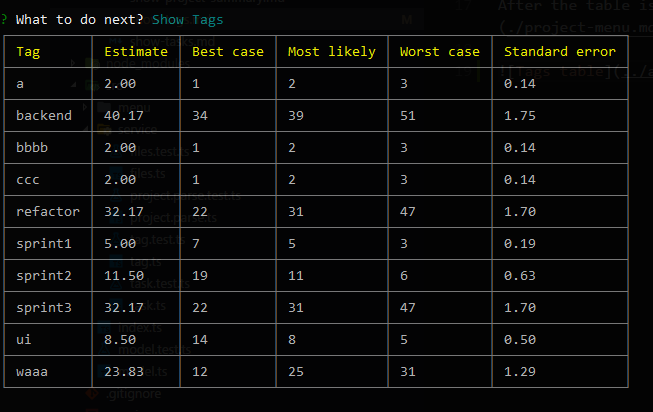

# EstiMate - Show tags

Collects the unique tags in the project, and shows them in a table.
All additional info of a specific tag is calculated from the tasks that have that specific tag among their tags.

### Shown infos:

| Info           | Description |
|----------------|-------------|
| Tag            | name of the tag
| Estimate       | sum of the tasks's wheighted average of estimate values
| Best case      | sum of the tasks's values
| Most likely    | sum of the tasks's values
| Worst Case     | sum of the tasks's values
| Standard error | calculated from the tasks's standard errors

After the table is shown, you are back to the [project menu](./project-menu.md).

